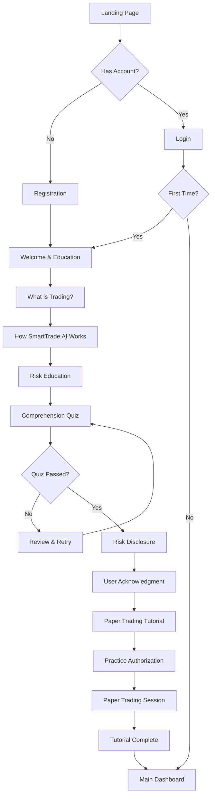
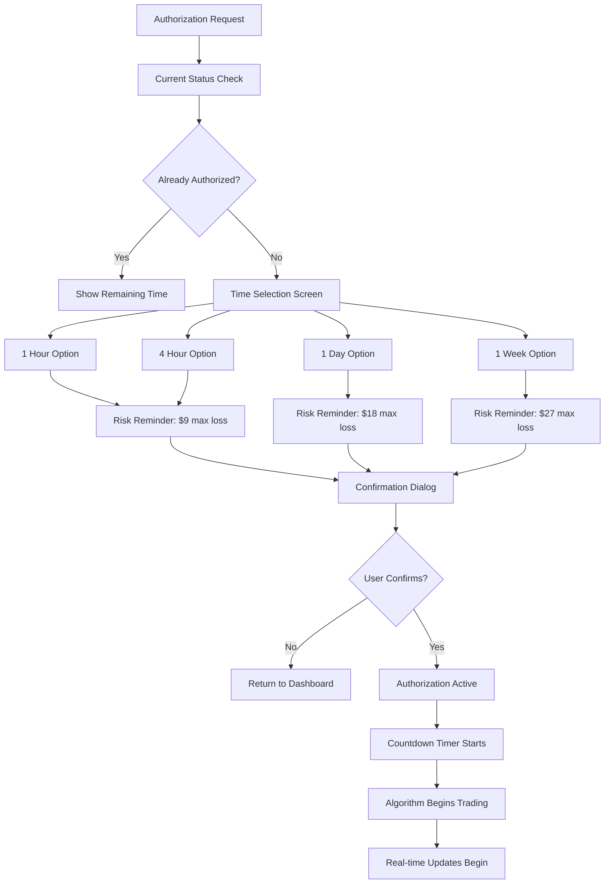
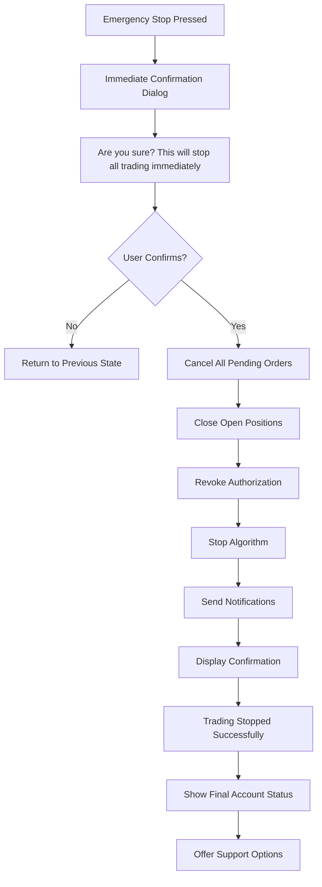
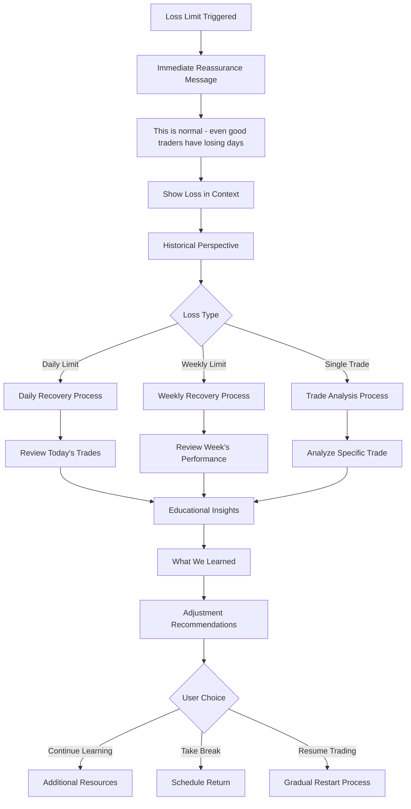

# SmartTrade AI Trading Platform UI/UX Specification

*Document Status: In Progress*
*Created by: UX Expert (Sally)*
*Date: January 10, 2025*

---

## Introduction

This document defines the user experience goals, information architecture, user flows, and visual design specifications for SmartTrade AI Trading Platform's user interface. It serves as the foundation for visual design and frontend development, ensuring a cohesive and user-centered experience.

### Overall UX Goals & Principles

#### Target User Personas

**Primary Persona: Cautious First-Timer with Small Capital**
- **Demographics:** Age 18-65, minimal trading knowledge, $90-$500 available
- **Technical Knowledge:** Minimal - does not understand trading terminology or technical analysis
- **Portfolio Needs:** Wants to see exactly what stocks they own, understand their gains/losses in simple terms
- **Algorithm Relationship:** Curious but nervous about letting AI make decisions with their money
- **Portfolio Concerns:** "Am I diversified?" "Why did the AI buy this stock?" "How much am I actually making?"
- **Interface Requirements:** Ultra-simple explanations, emoji indicators for gains/losses, educational transparency
- **Trust Factors:** Needs to understand every decision in plain English, maximum safety controls

**Secondary Persona: Algorithm-Curious Retail Investor**
- **Demographics:** Has basic investing knowledge (401k, maybe some ETFs), $500-$5000 available
- **Experience Level:** Understands concepts like sectors, P&L, but wants AI to do the technical analysis
- **Portfolio Sophistication:** Wants portfolio allocation breakdown, performance comparison to benchmarks
- **Algorithm Expectations:** Clear explanations of algorithm reasoning, ability to review decisions
- **Key Needs:** Understanding algorithm decisions, sector diversification visibility, performance metrics
- **Interface Preferences:** Professional credibility balanced with accessible explanations

**Tertiary Persona: Busy Professional Seeking Passive Growth**
- **Demographics:** High earner, no time for active trading, $1000-$10000 available
- **Goals:** Set-and-forget growth, monthly performance summaries, risk management
- **Portfolio Management:** Quick portfolio health check, performance trending, benchmark comparisons  
- **Algorithm Expectations:** Professional-grade decisions with minimal intervention required
- **Dashboard Needs:** Efficient overview, emergency stop access, performance attribution
- **Time Constraints:** Wants comprehensive data available but condensed into quick insights

#### Usability Goals

- **Instant Comprehension**: Any user can understand the interface within 30 seconds without external help
- **Educational Transparency**: Every action and decision is explained in plain English (8th grade reading level)
- **Trust Building**: Interface builds confidence through clear explanations and professional appearance
- **Error Prevention**: Multiple confirmation steps for financial decisions with clear risk explanations
- **Immediate Control**: Emergency stop functionality always visible and accessible
- **Learning Support**: Progressive disclosure allows users to learn at their own pace

#### Design Principles

1. **Radical Simplicity with Professional Credibility** - Make complex trading accessible while maintaining trust in financial decisions
2. **Educational Transparency Over Efficiency** - Prioritize user understanding over speed of interaction
3. **Safety First, Always** - Every design decision prioritizes user capital protection and risk awareness
4. **Conversational Intelligence** - Algorithm communicates like a patient, knowledgeable teacher
5. **Progressive Trust Building** - Interface gradually builds user confidence through successful experiences

### Change Log

| Date | Version | Description | Author |
|------|---------|-------------|---------|
| 2025-01-10 | 1.0 | Initial UI/UX specification creation from PRD | Sally (UX Expert) |

---

## Information Architecture (IA)

### Site Map / Screen Inventory

**Jobs-Based Information Architecture:** Navigation structure organized around core user jobs rather than technical features.

```mermaid
graph TD
    A[Landing/Login] --> B[Onboarding Flow]
    A --> C[Main Dashboard]
    
    B --> B1["Welcome & Education<br/>(What is trading?)"]
    B --> B2["Risk Disclosure<br/>(Friendly conversation)"]
    B --> B3["Paper Trading Tutorial<br/>(Hands-on practice)"]
    B --> B4["Comprehension Validation<br/>(Quiz checkpoints)"]
    
    C --> D["Control Center<br/>(Safety Jobs)"]
    C --> E["Portfolio Understanding<br/>(Comprehension Jobs)"]
    C --> F["Algorithm Transparency<br/>(Trust-Building Jobs)"]
    C --> G["Performance Validation<br/>(Progress Jobs)"]
    
    D --> D1["Session Management"]
    D --> D2["Emergency Stop"]
    D --> D3["Authorization Controls"]
    D --> D4["Risk Limits Status"]
    
    E --> E1["Current Positions<br/>(What do I own?)"]
    E --> E2["Sector Allocation<br/>(Am I diversified?)"]
    E --> E3["P&L Summary<br/>(Am I winning?)"]
    E --> E4["Top Gainers/Losers<br/>(What's working?)"]
    
    F --> F1["Recent Decisions<br/>(Why did AI do that?)"]
    F --> F2["Market Analysis<br/>(What is AI seeing?)"]
    F --> F3["Strategy Performance<br/>(Which approach works?)"]
    F --> F4["Algorithm Status<br/>(Is AI healthy?)"]
    
    G --> G1["Performance Metrics<br/>(How am I doing?)"]
    G --> G2["Win/Loss Ratios<br/>(Am I successful?)"]
    G --> G3["Growth Tracking<br/>(Am I progressing?)"]
    G --> G4["Benchmark Comparison<br/>(vs Market/Goals)"]
```

### Navigation Structure

**Jobs-Based Navigation Philosophy:** Navigation organized around user jobs rather than technical features, maintaining banking app familiarity with ultra-simple dashboard approach.

**Primary Navigation (Job-Centered):**
- **Desktop**: Persistent left sidebar with job-based sections and always-visible emergency controls
- **Tablet**: Collapsible sidebar maintaining job hierarchy and safety-first approach
- **Mobile**: Bottom navigation with safety controls persistent at top

**Core Navigation Elements (Organized by Jobs):**

**1. Control Center (Safety Jobs) - Primary Position**
- **Session Control** (🎯 target icon) - "Am I in control?" - Authorization and session management
- **Emergency Stop** (🛑 stop icon) - "Stop everything now!" - Always prominent, all screens
- **Risk Monitor** (⚠️ warning icon) - "Am I safe?" - Current limits and risk status

**2. Portfolio Understanding (Comprehension Jobs) - Secondary**
- **My Holdings** (💼 briefcase icon) - "What do I own?" - Current positions and allocation
- **Performance** (📈 chart icon) - "How am I doing?" - P&L, growth tracking, benchmarks

**3. Algorithm Insights (Trust-Building Jobs) - Tertiary**
- **AI Decisions** (🧠 brain icon) - "Why did AI do that?" - Recent decisions and reasoning
- **Market View** (👁️ eye icon) - "What is AI seeing?" - Market analysis and strategy status

**4. Settings & Help (Support Jobs) - Contextual**
- **Settings** (⚙️ gear icon) - User preferences and account management
- **Help & Learn** (❓ question icon) - Educational resources and support

**Secondary Navigation Strategy:**
- **Progressive Disclosure**: Advanced features behind "Tell me more" links
- **Context-Sensitive Options**: Relevant controls appear based on current screen
- **Educational Integration**: Every navigation choice includes learning opportunities
- **Risk Awareness**: Navigation includes risk context where appropriate

**Mobile-Desktop Adaptation:**
- **Responsive Hierarchy**: Account balance and emergency stop always prioritized
- **Touch-Friendly**: Minimum 44px touch targets on mobile
- **Gesture Support**: Swipe between main sections on mobile
- **Consistent Emergency Access**: Red stop button maintains prominence across all screen sizes

**Breadcrumb Strategy:** 
- **Minimal Implementation**: Only for deep settings navigation (Settings > Notifications > Email)
- **Educational Context**: Breadcrumbs include helpful explanations ("Settings help you control how the bot communicates with you")
- **Single-Level Focus**: Most functionality stays at top level to avoid navigation anxiety

### Risk Mitigation Strategies

**Information Overload Prevention:**
- **Progressive Reveal System**: Dashboard sections can be collapsed/expanded based on user comfort level
- **Guided Tours**: First-time users get step-by-step introduction to each interface element
- **Focus Mode**: Option to hide non-essential elements during active trading periods
- **Adaptive Complexity**: Interface complexity increases gradually as user demonstrates competency

**Mobile Navigation Optimization:**
- **Adaptive UI Priority**: Screen real estate automatically prioritizes most critical elements
- **Contextual Navigation**: Bottom nav items change based on current user task
- **Gesture Fallbacks**: Swipe gestures provide alternative navigation when screen space is limited
- **Emergency Access**: Red stop button adapts size and position based on available screen space

**Algorithm Communication Clarity:**
- **Structured Conversation Flows**: Algorithm responses follow predictable patterns to set expectations
- **AI Limitations Messaging**: Clear indicators when algorithm reaches limits of explanation capability
- **Response Categories**: Algorithm messages clearly labeled as "Market Update," "Decision Explanation," or "Performance Summary"
- **Fallback Responses**: Graceful handling when algorithm cannot provide specific explanations

**Regulatory Compliance Integration:**
- **Dual-Layer Disclosure**: Simple explanations paired with expandable legal language
- **Contextual Legal Reminders**: Risk disclosures appear at decision points without disrupting flow
- **Audit Trail Integration**: All user interactions logged for regulatory compliance
- **Professional Mode Legal**: Professional toggle includes more detailed regulatory language

**Performance & Technical Resilience:**
- **Graceful Degradation**: Interface remains functional even if real-time updates fail
- **Offline Indicators**: Clear visual feedback when data connections are interrupted
- **Efficient Data Streaming**: Optimized WebSocket usage to prevent performance issues
- **Backup Information Display**: Cached data shown when live updates unavailable

**User Behavior Safeguards:**
- **Escalating Risk Reminders**: Risk warnings become more prominent with longer authorization periods
- **Mandatory Cooling-Off**: Forced breaks after significant losses or extended trading sessions
- **Independent Decision Checkpoints**: Periodic prompts requiring user to make decisions without algorithm input
- **Educational Progression Gates**: Advanced features unlock only after demonstrating understanding

---

## User Flows

### First-Time User Onboarding Flow

**User Goal:** Complete onboarding process and understand how to safely use the SmartTrade AI platform

**Entry Points:** Landing page, registration completion, first login

**Success Criteria:** User completes all educational modules, passes comprehension validation, and successfully authorizes first paper trading session

#### Flow Diagram

#### Edge Cases & Error Handling:
- User fails comprehension quiz multiple times → Additional educational resources provided
- User abandons onboarding mid-process → Progress saved, gentle re-engagement email sent
- Technical issues during paper trading → Graceful fallback to demo mode
- User tries to skip educational sections → Blocked with explanation of importance
- Regulatory disclosure not acknowledged → Cannot proceed until explicit consent given

**Notes:** Onboarding flow prioritizes education over speed, with multiple checkpoints to ensure user understanding before allowing real money trading.

### Express Authorization Flow

**User Goal:** Grant trading permission to SmartTrade AI algorithm for specific time period

**Entry Points:** Main dashboard authorization button, expired authorization renewal, post-login prompt

**Success Criteria:** User successfully authorizes trading with full understanding of risks and time limits

#### Flow Diagram

#### Edge Cases & Error Handling:
- User tries to authorize while markets are closed → Warning message with next market open time
- Network failure during authorization → Retry mechanism with offline indicator
- User attempts to extend authorization near loss limits → Additional risk warnings required
- Authorization expires during active trade → Trade completes, new authorization required for next trade
- User authorizes maximum time period repeatedly → Cooling-off period enforced

**Notes:** Authorization flow includes escalating risk warnings based on time period selected, with mandatory confirmation steps for longer periods.

### Emergency Stop Flow

**User Goal:** Immediately halt all trading activity and secure account

**Entry Points:** Red emergency stop button (always visible), panic situation, unexpected losses

**Success Criteria:** All trading stops within 30 seconds, user receives confirmation, account is secured

#### Flow Diagram

#### Edge Cases & Error Handling:
- Network failure during emergency stop → Local state change with retry mechanism
- Positions cannot be closed immediately → Market order placement with user notification
- Stop pressed accidentally → Quick restart option available for 60 seconds
- Multiple stop requests → Idempotent handling prevents duplicate actions
- Stop during market closure → Confirmation that no active trading to stop

**Notes:** Emergency stop prioritizes speed and certainty, with immediate visual feedback and comprehensive status reporting.

### Loss Recovery Flow

**User Goal:** Understand and recover from trading losses while learning from the experience

**Entry Points:** Daily loss limit reached, weekly loss limit hit, significant single trade loss, user panic

**Success Criteria:** User feels supported, understands what happened, and is prepared to continue or take a break

#### Flow Diagram

#### Edge Cases & Error Handling:
- User extremely upset about losses → Immediate access to support resources
- Multiple consecutive loss days → Extended cooling-off period with educational content
- User wants to increase risk after losses → Additional risk education required
- Technical issues during loss event → Clear explanation that losses weren't due to system failure
- User blames algorithm → Balanced explanation of market realities and algorithm limitations

**Notes:** Recovery flow emphasizes learning and emotional support while preventing revenge trading behaviors.

### Flow Refinements & Improvements

**Enhanced Onboarding Features:**
- **Adaptive Learning Paths**: Quiz performance determines additional education or acceleration
- **Progress Indicators**: Visual completion percentage with estimated time remaining
- **Confidence Checkpoints**: "I need more help" and "I understand, let's continue" options at each step
- **Peer Success Stories**: Brief testimonials from similar users to build confidence
- **Save & Resume**: Ability to pause lengthy educational content and return later

**Dynamic Authorization Enhancements:**
- **Market-Aware Risk Warnings**: Risk estimates adjust based on current VIX and volatility
- **Historical Context**: "In the last 30 days, average daily change was $2.50" type information
- **Recommendation Engine**: Algorithm suggests optimal authorization periods based on market conditions
- **Visual Countdown**: Color-coded timer (green→yellow→red) showing remaining authorization time
- **Educational Tooltips**: "Why these time limits?" explanations for each option

**Smart Emergency Stop Options:**
- **Immediate Stop**: Instant halt with market orders (current behavior)
- **Smart Stop**: Attempts better exit prices when market conditions allow
- **Impact Preview**: Shows estimated difference between immediate vs smart stop
- **Process Transparency**: Real-time status updates during stop execution
- **Recovery Planning**: Option to schedule restart after cooling-off period

**Mobile-Specific Optimizations:**
- **Gesture Support**: Swipe patterns for common actions
- **Voice Confirmation**: Optional voice commands for emergency stop
- **Simplified Flows**: Reduced steps for mobile-specific user journeys
- **Touch-Optimized**: Larger touch targets and mobile-friendly interactions

**Error State Improvements:**
- **Contextual Help**: Specific recovery suggestions based on error type
- **Progressive Assistance**: "Try again" → "Get help" → "Contact support" escalation
- **Learning Opportunities**: Turn errors into educational moments when appropriate
- **Graceful Degradation**: Maintain core functionality even when advanced features fail

---

## Wireframes & Mockups

### Design Files

**Primary Design Files:** To be created in Figma - SmartTrade AI Design System
- **Project URL**: [To be provided after Figma workspace setup]
- **Design System**: Custom components optimized for ultra-simple financial interface
- **Collaboration**: Shared workspace for development team handoff

### Key Screen Layouts

#### Main Dashboard

**Purpose:** Central hub showing account status, algorithm performance, and trading controls in ultra-simple format

**Key Elements:**
- **Account Balance Card**: Large, prominent display with today's change (green/red indicator)
- **Algorithm Status Panel**: Simple status indicator showing algorithm activity ("Working", "Paused", "Stopped")
- **Authorization Status**: Visual countdown timer with color coding (green→yellow→red)
- **Emergency Stop Button**: Large red button, always visible in top-right corner
- **Performance Summary**: Simple win/loss ratio with emoji indicators (😊/😞)
- **Recent Activity**: Last 3 trades with plain English descriptions ("Made $3 buying Apple stock")

**Interaction Notes:** 
- Single-screen layout prevents navigation confusion
- All critical information visible without scrolling on desktop
- Mobile version stacks vertically with emergency stop remaining prominent
- Algorithm status shows simple working/paused states without complex explanations

**Design File Reference:** [Dashboard_Main_v1.fig - Frame 1]

#### Express Authorization Screen

**Purpose:** Time-based trading permission interface with clear risk communication

**Key Elements:**
- **Time Selection Cards**: Four large buttons (1hr, 4hr, 1day, 1week) with visual time indicators
- **Dynamic Risk Warnings**: Context-aware loss limits based on current market volatility
- **Historical Context**: "In the last 30 days, average daily change was $2.50"
- **Recommendation Badge**: Algorithm suggests optimal time period with reasoning
- **Confirmation Dialog**: Multi-step confirmation with risk acknowledgment
- **Visual Timer**: Countdown display with progress bar and color transitions

**Interaction Notes:**
- Risk warnings escalate visually for longer time periods
- Confirmation requires explicit checkbox acknowledgment
- Timer visible from all screens once authorization is active
- Mobile version uses full-screen cards for better touch interaction

**Design File Reference:** [Authorization_Flow_v1.fig - Frames 2-4]

#### Onboarding Flow Screens

**Purpose:** Educational journey from complete beginner to confident paper trading

**Key Elements:**
- **Progress Indicator**: Visual completion bar with step numbers and estimated time
- **Educational Cards**: Bite-sized learning modules with illustrations
- **Comprehension Checkpoints**: Interactive quizzes with immediate feedback
- **Confidence Selectors**: "I need more help" vs "I understand, let's continue" options
- **Paper Trading Simulator**: Realistic interface for risk-free practice
- **Success Celebrations**: Positive reinforcement for completed milestones

**Interaction Notes:**
- Adaptive flow adjusts content based on user responses
- Save & resume functionality for lengthy educational content
- Peer success stories integrated at confidence-building moments
- Mobile version uses card-swiping for natural progression

**Design File Reference:** [Onboarding_Journey_v1.fig - Frames 8-15]

#### Emergency Stop & Recovery Screens

**Purpose:** Crisis management interface for immediate trading halt and user support

**Key Elements:**
- **Emergency Confirmation**: Large, clear dialog with immediate vs smart stop options
- **Process Status**: Real-time updates showing stop execution progress
- **Final Status Display**: Account summary with clear "Trading Stopped" confirmation
- **Support Access**: Immediate connection to help resources and human support
- **Recovery Options**: Scheduled restart and cooling-off period settings
- **Impact Analysis**: Shows difference between immediate and smart stop results

**Interaction Notes:**
- Prioritizes speed and clarity over visual polish
- Status updates provide reassurance during stop execution
- Recovery planning helps prevent panic-driven decisions
- Mobile version maintains large touch targets for stressed users

**Design File Reference:** [Emergency_Stop_v1.fig - Frames 16-18]

#### Loss Recovery & Support Screens

**Purpose:** Emotional support and educational interface for handling trading losses

**Key Elements:**
- **Reassurance Messaging**: Calm, supportive language with loss normalization
- **Context Visualization**: Charts showing loss in historical perspective
- **Learning Modules**: "What we learned" educational content with actionable insights
- **Emotional Check-in**: Simple mood indicators and support resource access
- **Recovery Planning**: Options for break scheduling or gradual restart
- **Success Reminders**: Previous wins and positive performance highlights

**Interaction Notes:**
- Warm, supportive visual design with calming colors
- Educational content presented as opportunity rather than failure
- Multiple exit paths based on user emotional state
- Mobile version emphasizes accessibility during stressful moments

**Design File Reference:** [Loss_Recovery_v1.fig - Frames 19-21]

---

## Responsiveness Strategy

### Breakpoints

**Competitive-Analysis-Informed Breakpoint Strategy:**

| Breakpoint | Min Width | Max Width | Target Devices | Portfolio Display Strategy |
|------------|-----------|-----------|----------------|---------------------------|
| **Mobile** | 320px | 768px | Cautious First-Timers on phones | Card-stack with swipe navigation, floating emergency button |
| **Tablet** | 769px | 1024px | All personas, mixed usage | Dual-column layout, collapsible panels, header emergency controls |
| **Desktop** | 1025px | 1440px | Professional users, detailed analysis | Multi-column dashboard, all data visible, comprehensive charts |
| **Wide** | 1441px | - | Advanced traders, multiple monitors | Side-by-side views, expanded analytics, professional-grade interface |

### Adaptation Patterns

**Mobile-First Responsive Architecture (320-768px):**

**Layout Changes:**
- **Card-Stack Portfolio Display:** Vertical scrolling with clear hierarchy (Total Value → Individual Positions → Details)
- **Floating Emergency Button:** Always-visible red FAB in bottom-right with thumb-reachable positioning
- **Progressive Data Disclosure:** Summary cards expand to reveal intermediate details, then full analysis
- **Single-Column Navigation:** Bottom tab bar with portfolio as primary section
- **Sticky Portfolio Summary:** Total value and daily change remain visible while scrolling positions

**Navigation Changes:**
- **Bottom Tab Pattern:** Primary functions (Portfolio, Control, Performance, AI Insights) always accessible
- **Context-Aware Header:** Emergency controls and session status in persistent top bar
- **Swipe Gestures:** Horizontal swipe between portfolio positions, vertical scroll through position list
- **Quick Actions:** Swipe-down from top reveals emergency controls and session management
- **Minimal Navigation Depth:** Maximum 2 taps to reach any core functionality

**Content Priority:**
- **Safety-First Hierarchy:** Emergency stop and session controls most prominent
- **Essential Data Only:** Portfolio total, today's change, active positions, algorithm status
- **Algorithm Transparency:** "Why AI did this" explanations prominent but collapsible
- **Educational Integration:** Contextual tooltips and help without overwhelming interface
- **Trust-Building Elements:** Clear algorithm status and decision reasoning visible

**Interaction Changes:**
- **Touch-Optimized Controls:** Minimum 44px touch targets, generous spacing around interactive elements
- **Gesture Support:** Pull-to-refresh for manual data updates, swipe actions on position cards
- **Haptic Feedback:** Tactile confirmation for emergency stop and authorization actions
- **Voice Accessibility:** Emergency stop accessible via voice commands for accessibility
- **One-Handed Usage:** All critical controls reachable with thumb in standard phone grip

### Mobile Portfolio Management Patterns

**Based on competitive analysis of successful trading apps:**

**Card-Stack Architecture (Inspired by Robinhood + Banking Apps):**
- **Portfolio Summary Card:** Large total value with prominent daily change indicator
- **Position Cards:** Individual stock holdings with swipe-to-reveal details
- **Performance Cards:** Win/loss ratios and growth tracking with visual progress indicators
- **Algorithm Cards:** Recent AI decisions with plain-English explanations

**Emergency Control Innovation (Superior to Traditional Apps):**
- **Floating Action Button:** Red emergency stop always visible, never hidden in menus
- **Two-Step Confirmation:** Impact preview before execution ("This will close 3 positions")
- **Process Transparency:** Real-time status updates during emergency stop execution
- **Quick Recovery:** Option to restart trading after cooling-off period

**Progressive Data Disclosure (Best of E-Trade + Betterment):**
- **Level 1:** Portfolio total, daily change, algorithm status
- **Level 2:** Individual positions, sector allocation, recent decisions
- **Level 3:** Detailed analytics, performance attribution, strategy breakdown
- **Educational Overlays:** Contextual explanations available at each level

**Algorithm Transparency (Exceeding Robo-Advisor Standards):**
- **Decision Timeline:** Chronological list of AI actions with reasoning
- **Market Context:** "AI saw this market condition and decided to..."
- **Performance Attribution:** "This decision contributed $X to your returns"
- **Learning Integration:** "Here's what this means for your portfolio"

### Tablet & Desktop Enhancements

**Tablet Optimization (769-1024px):**
- **Dual-Column Layout:** Portfolio summary and controls left, detailed positions right
- **Collapsible Panels:** Expandable sections for advanced features without overwhelming beginners
- **Enhanced Visualizations:** Larger charts and graphs with interactive elements
- **Persistent Emergency Controls:** Header-based emergency stop with desktop-style confirmation

**Desktop Excellence (1025px+):**
- **Multi-Column Dashboard:** All critical data visible without scrolling
- **Professional Features:** Advanced analytics and detailed performance attribution
- **Comprehensive Charts:** Full-size visualizations with multiple timeframes and indicators
- **Efficient Workflows:** Keyboard shortcuts and rapid navigation for power users

### Performance Considerations

**Mobile Performance Optimization:**
- **Selective Real-Time Updates:** Only update visible portfolio data to preserve battery and performance
- **Batch Update Strategy:** Group multiple price changes into single render cycles
- **Connection-Aware:** Graceful degradation when real-time data unavailable
- **Manual Refresh Control:** Pull-to-refresh for user-controlled data updates
- **Optimized Asset Loading:** Progressive image loading and efficient API calls

**Cross-Device Consistency:**
- **Synchronized State Management:** Portfolio data consistent across all devices
- **Responsive Component Library:** Same components adapt fluidly across breakpoints
- **Progressive Enhancement:** Core functionality works on all devices, advanced features enhance experience on capable devices
- **Accessibility Compliance:** Touch, mouse, and keyboard interactions supported across all screen sizes

---

*[Document continues as sections are developed collaboratively...]*
